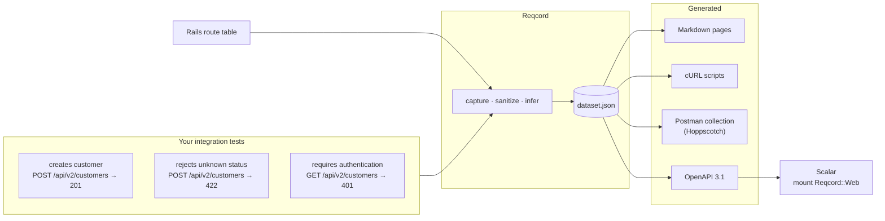

# Reqcord

[](https://github.com/ahmetsaridogan/reqcord/actions/workflows/ci.yml)
[](https://rubygems.org/gems/reqcord)

**Turn your Rails integration tests into API documentation.**

Reqcord runs your test suite, watches the HTTP requests and responses the
tests make, and writes the documentation from what it saw — Markdown,
runnable cURL, a Postman collection and an OpenAPI document. No DSL, no
annotations, no second copy of every request: the tests are the source of
truth.



## Quick start

```ruby
# Gemfile
group :development, :test do
  gem "reqcord"
end
```

```bash
bundle install
bin/rails reqcord:init        # writes reqcord.yml — point test.paths at your API tests
bin/rails reqcord:generate    # runs them with capture on, writes docs/api/
```

```text
[reqcord] captured 87 request(s), 85 matched a documented route
[reqcord] captured a successful 2xx request for 15 of 16 endpoint(s)
[reqcord] routes: 18 = 15 documented + 1 uncovered + 2 skipped
```

Every route ends in exactly one bucket, so nothing goes missing quietly.

Optionally, browse it inside the app with Scalar:

```ruby
# config/routes.rb
mount Reqcord::Web => "/api-docs" if Rails.env.development?
```

## What you get

From an ordinary test —

```ruby
test "creates customer" do
  post "/api/v2/customers",
    params: { customer: { name: "John Doe", email: "john@example.com", status: "active" } },
    headers: { "Authorization" => "Bearer test-token" },
    as: :json

  assert_response :created
end
```

— a page like this, plus a `create.sh`, a Postman request and an OpenAPI
operation built from the same captured request:

````markdown
# Create Customer

`POST /api/v2/customers`

## Body Parameters

| Field | Type | Required | Values |
| --- | --- | --- | --- |
| `customer.name` | string | yes | `"John Doe"` |
| `customer.email` | string | yes | `"john@example.com"` |
| `customer.status` | string | yes | `"active"` \| `"passive"` |

## cURL

```bash
curl --request POST \
  --url "http://localhost:3000/api/v2/customers" \
  --header "Authorization: Bearer {{token}}" \
  --header "Content-Type: application/json" \
  --data '{"customer":{"name":"John Doe","email":"john@example.com","status":"active"}}'
```

## Responses

### 201 Created
### 401 Unauthorized
### 422 Unprocessable Content
````

The parameter table is inferred from the requests the application
**accepted**: two tests sent `"active"` and `"passive"`, a third sent
`"inactive"` and got a `422`, so the page lists the two values that work and
keeps the rejection as a response example. Credentials never reach a file —
`Bearer test-token` became `Bearer {{token}}` before anything was stored.

## Documentation

| | |
| --- | --- |
| [Getting started](docs/getting-started.md) | install, configure, generate, read the output |
| [Configuration](docs/configuration.md) | every key in `reqcord.yml`, defaults and environment overrides |
| [Exporters](docs/exporters.md) | Markdown, cURL, Postman / Hoppscotch, OpenAPI — what each contains |
| [Reqcord::Web](docs/web.md) | serve the docs from the app with Scalar |
| [Route coverage](docs/route-coverage.md) | how the route table becomes endpoints; `resource`, `match via:`, engines, filters |
| [Capture and inference](docs/capture.md) | what is captured, sanitization, how parameter tables and response fields are derived, the dataset |
| [Troubleshooting](docs/troubleshooting.md) | when the output looks thin |
| [Architecture](docs/architecture.md) | pipeline, modules, design principles, working on Reqcord |
| [Changelog](CHANGELOG.md) | |

## Examples

Four runnable applications under [`examples/`](examples), each with the
documentation it generates committed next to it:

| Example | Tests | Shows |
| --- | --- | --- |
| [`test-app`](examples/test-app) | Minitest | three small resources: auth, closed value sets, PATCH/PUT folding, a member action |
| [`spec-app`](examples/spec-app) | RSpec | the same API from request specs |
| [`complex-test-app`](examples/complex-test-app) | Minitest | a store API: products, cart, orders, nested notes, array bodies, `filter[category]`, a form login, `X-Api-Key` admin namespace, two API versions, 400/403/404/409 |
| [`complex-spec-app`](examples/complex-spec-app) | RSpec | the store API from request specs |

[`examples/reqcord.yml`](examples/reqcord.yml) is an annotated configuration
file.

## Supported versions

| | |
| --- | --- |
| Ruby | 3.2, 3.3, 3.4 |
| Rails | 7.1, 7.2, 8.0, 8.1 |
| Tests | Minitest integration tests, RSpec request specs |

Every Ruby × Rails pair Rails itself supports runs in CI.

## Principles

* **Tests are the source of truth.** Reqcord never reads models, serializers
  or contracts; what the application accepted and answered is the spec.
* **Capture once, export anywhere.** One dataset, any number of formats.
* **Nothing is lost silently.** `routes = documented + uncovered + skipped`,
  reconciled on every run.
* **Generated docs are safe.** Sanitization runs before anything is stored.

## License

MIT.
